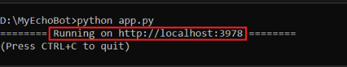
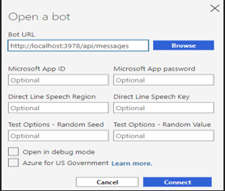
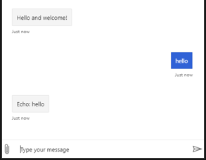

# Create a bot with the Bot Framework SDK

### Prerequisites

- Python 3.8.3
- Bot Framework Emulator
- Knowledge of asynchronous programming in Python

Windows

```Windows
python -m venv venv
venv\Scripts\activate.bat
```

#### Python templates

```Console
pip install botbuilder-core
pip install asyncio
pip install aiohttp
pip install cookiecutter==1.7.0

```

### Create a bot

```
python -m cookiecutter https://github.com/microsoft/BotBuilder-Samples/releases/download/Templates/echo.zip
```

You'll be prompted to give your bot a name and description. Enter the following values:

```
bot_name: "enter name"

bot_description: "enter description"
```

1. From the command line/terminal, change directories to echo_bot.

   ```
   cd your-bot-name
   ```

2. Install the dependencies for the echo bot template.
   ```
   pip install -r requirements.txt
   ```
3. After the dependencies are installed, run the following command to start your bot:
   ```
   python app.py
   ```
   

## Start the Emulator and connect your bot

1. Start the Bot Framework Emulator.
2. Select Open Bot on the Emulator's Welcome tab.
3. Enter your bot's URL, which is your local host and port, with /api/messages added to the path. The address is usually: `http://localhost:3978/api/messages`
   
4. Then select Connect.

Send a message to your bot, and the bot will respond back.

